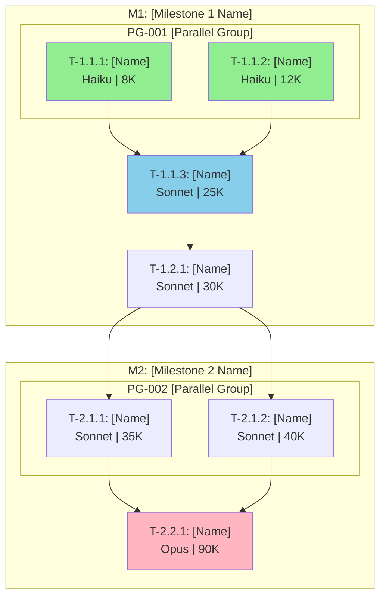
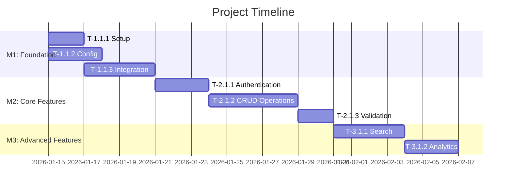

# Phase 2: Planning Templates

<!-- LOAD ON-DEMAND -->

**CodeMaestro v1.0.0**
**Phase:** 2 (Planning) - Software Architect
**Purpose:** Templates for architecture blueprint, task decomposition, and planning artifacts

---

## Template 1: Architecture Blueprint {#architecture-blueprint}

```markdown
# Engineering Blueprint v1.0

**Project:** [Project Name]
**Version:** 1.0
**Date:** [YYYY-MM-DD]
**Architect:** [Name or "CodeMaestro System"]
**CodeMaestro:** v1.0.0

---

## Meta

| Field | Value |
|-------|-------|
| Domain | [Mobile / Web / Cloud / AI/ML] |
| Pattern | [e.g., Microservices, Layered, Event-Driven] |
| Scale | [Small / Medium / Large] |
| Team Size | [N] developers |
| Skill Tier | [Beginner / Advanced / Ninja] |

---

## Architecture Overview

**Primary Pattern:** [Architectural pattern name]

**Core Principles:**
- [Principle 1: e.g., KISS - Keep It Simple]
- [Principle 2: e.g., DRY - Don't Repeat Yourself]
- [Principle 3: e.g., SOLID principles]

**Design Philosophy:**
[2-3 sentences describing the high-level design approach and rationale]

---

## Domain Adaptations

**Detected Domain:** [Mobile / Web / Cloud / AI/ML]

**Domain-Specific Patterns Applied:**

### For Mobile:
- [ ] Offline-first architecture with local data sync
- [ ] Platform-specific UI patterns (iOS HIG / Material Design)
- [ ] Battery and memory optimization strategies
- [ ] App store deployment pipeline

### For Web:
- [ ] Responsive design (mobile-first approach)
- [ ] Frontend-backend separation (REST / GraphQL)
- [ ] CDN and caching strategies
- [ ] SEO optimization

### For Cloud:
- [ ] Microservices architecture
- [ ] Cloud-native patterns (12-factor app)
- [ ] Auto-scaling strategies
- [ ] Distributed tracing and observability

### For AI/ML:
- [ ] Data pipeline architecture
- [ ] Model serving infrastructure
- [ ] Training vs inference separation
- [ ] Model drift monitoring

**Domain-Specific Considerations:**
- [Consideration 1]
- [Consideration 2]

---

## System Context Diagram

\```mermaid
graph LR
    User[User] --> Frontend[Frontend]
    Frontend --> API[API Gateway]
    API --> Service1[Service 1]
    API --> Service2[Service 2]
    Service1 --> DB[(Database)]
    Service2 --> DB
\```

**External Dependencies:**
- [Dependency 1: e.g., Payment Gateway]
- [Dependency 2: e.g., Email Service]

---

## Component Diagram

\```mermaid
graph TD
    subgraph "Presentation Layer"
        UI[UI Components]
    end
    subgraph "Business Logic Layer"
        Services[Services]
    end
    subgraph "Data Access Layer"
        Repositories[Repositories]
    end
    subgraph "Infrastructure"
        Database[(Database)]
        Cache[(Cache)]
    end

    UI --> Services
    Services --> Repositories
    Repositories --> Database
    Services --> Cache
\```

---

## Component Descriptions

### Component 1: [Name]

**Responsibility:** [Single primary responsibility]

**Technology:** [Language/Framework/Library]

**Interfaces:**
- **Input:** [What it receives]
- **Output:** [What it produces]
- **Dependencies:** [Other components it depends on]

**Key Classes/Modules:**
- `[Class1]`: [Purpose]
- `[Class2]`: [Purpose]

**State Management:**
- Pattern: [e.g., Redux, Event Sourcing]
- Source of Truth: [Where state is stored]

**Security Considerations:**
- [Security aspect 1]
- [Security aspect 2]

### Component 2: [Name]
[Repeat structure above]

---

## Architectural Decisions (ADRs)

### ADR-001: [Decision Title]

**Status:** Accepted
**Date:** [YYYY-MM-DD]
**Context:** [What situation led to this decision]

**Decision:** [What was decided]

**Rationale:**
- [Reason 1]
- [Reason 2]
- [Reason 3]

**Alternatives Considered:**
| Option | Pros | Cons | Chosen |
|--------|------|------|--------|
| Option A | [Pros] | [Cons] | ✅ |
| Option B | [Pros] | [Cons] | ❌ |
| Option C | [Pros] | [Cons] | ❌ |

**Competitive Context:**
- **Competitor A Approach:** [How they solve this]
- **Competitor B Approach:** [Their solution]
- **Our Differentiator:** [How we're different/better]
- **Strategic Advantage:** [Why this matters for market position]

**Consequences:**
- **Positive:**
  - [Positive outcome 1]
  - [Positive outcome 2]
- **Negative:**
  - [Trade-off 1]
  - [Mitigation for trade-off 1]

**Constraint Compliance:**
- A7: [How API was confirmed via Context7]
- A14: [Dependency rationale]

---

## Security Architecture

### Authentication
**Method:** [e.g., JWT, OAuth 2.0, Session-based]
**Implementation:** [Details]
**Token Storage:** [Where and how tokens are stored]
**Expiration:** [Token lifetime]

### Authorization
**Model:** [e.g., RBAC, ABAC, ACL]
**Roles:** [List of user roles]
**Permissions:** [Permission matrix]

### Data Protection
**Encryption at Rest:** [Algorithm and implementation]
**Encryption in Transit:** [TLS version, certificate strategy]
**Sensitive Data:** [How PII/secrets are handled]

### Threat Model
| Threat | Mitigation | Status |
|--------|------------|--------|
| SQL Injection | Parameterized queries (constraint A7) | ✅ Addressed |
| XSS | Input sanitization, CSP headers | ✅ Addressed |
| CSRF | Anti-CSRF tokens | ✅ Addressed |

---

## Data Architecture

### Data Model

\```mermaid
erDiagram
    USER ||--o{ ORDER : places
    USER {
        uuid id
        string username
        string email
    }
    ORDER {
        uuid id
        uuid user_id
        timestamp created_at
    }
\```

### Data Stores

| Store | Type | Purpose | Technology | Version |
|-------|------|---------|------------|---------|
| Primary DB | Relational | Transactional data | PostgreSQL | 14.5 |
| Cache | In-Memory | Session + hot data | Redis | 7.0 |
| Search | Document | Full-text search | Elasticsearch | 8.4 |

### Data Flows

**Create Order Flow:**
1. User submits order → API Gateway
2. Validate input → Order Service
3. Check inventory → Inventory Service
4. Create transaction → Database (ACID)
5. Invalidate cache → Redis
6. Return confirmation → User

---

## Technology Stack

| Category | Technology | Version | Rationale | Competitive Edge |
|----------|------------|---------|-----------|------------------|
| Language | [e.g., TypeScript] | [X.Y.Z] | [Why chosen] | [vs competitors] |
| Framework | [e.g., NestJS] | [X.Y.Z] | [Why chosen] | [advantage] |
| Database | [e.g., PostgreSQL] | [X.Y.Z] | [Why chosen] | [edge] |
| Cache | [e.g., Redis] | [X.Y.Z] | [Why chosen] | [benefit] |
| Testing | [e.g., Jest] | [X.Y.Z] | [Why chosen] | [value] |

**Lock Files:**
- `package-lock.json` (npm)
- Or `requirements.lock` (pip)
- Or `Cargo.lock` (Rust)

**Constraint Compliance:**
- A1: All dependencies are production-ready with active maintenance
- A3: All versions pinned, lock files committed
- A7: All APIs validated via Context7

---

## API Contracts

**Format:** OpenAPI 3.0.3

**See:** `docs/architecture/api-contracts/openapi.yaml`

**Key Endpoints:**
- `POST /api/v1/auth/login` - User authentication
- `GET /api/v1/users/{id}` - Retrieve user
- `POST /api/v1/orders` - Create order

**Versioning Strategy:**
- URL-based versioning: `/api/v1/`, `/api/v2/`
- Support N-1 version during transitions
- Deprecation policy: 6-month notice

---

## Non-Functional Requirements Mapping

| NFR-ID | Requirement | Architectural Support |
|--------|-------------|----------------------|
| NFR-001 | P95 latency <200ms | Caching layer (Redis), optimized queries |
| NFR-002 | 99.9% uptime | Load balancing, auto-scaling, health checks |
| NFR-003 | Support 10K concurrent users | Horizontal scaling, stateless services |
| NFR-004 | GDPR compliance | Data encryption, audit logs, deletion APIs |

---

## Deployment Architecture

**Environment Strategy:**
- Development: Local Docker Compose
- Staging: Kubernetes cluster (similar to prod)
- Production: Kubernetes on [AWS EKS / GCP GKE / Azure AKS]

**CI/CD Pipeline:**
1. Code push → GitHub
2. Run tests → GitHub Actions
3. Build Docker image → Container Registry
4. Deploy to staging → Kubernetes (auto)
5. Run E2E tests → Staging environment
6. Manual approval → Production deployment

**Rollback Strategy:**
- Keep last 3 versions deployed
- Rollback via Kubernetes deployment revision
- Database migrations: Backward-compatible always

---

## Quality Thresholds

| Metric | Minimum (Blocking) | Target | Phase |
|--------|-------------------|--------|-------|
| Test Coverage | 70% | 85% | Phase 4 |
| Critical Security | 0 | 0 | Phase 4 |
| High Security | 0 | 0 | Phase 4 |
| AC Pass Rate | 100% | 100% | Phase 4 |
| P95 Latency | No regression >25% | <200ms | Phase 4 |

**Constraint Compliance:** E30-E33

---

## Dependencies & Risks

### External Dependencies

| Dependency | Type | Criticality | Fallback Strategy |
|------------|------|-------------|-------------------|
| Payment Gateway | External API | High | Queue orders, manual processing |
| Email Service | External API | Medium | Retry queue, log for manual send |
| CDN | Infrastructure | Low | Direct server fallback |

### Technical Risks

| Risk | Probability | Impact | Mitigation |
|------|------------|--------|------------|
| Database bottleneck | Medium | High | Read replicas, caching, query optimization |
| Third-party API downtime | High | Medium | Circuit breakers, fallbacks, retries |

---

## Version

**Blueprint Version:** 1.0
**CodeMaestro:** v1.0.0
**Last Updated:** [YYYY-MM-DD]
```

---

## Template 2: Task DAG {#task-dag}

> **⚠️ FORMAT:** This file MUST be in Markdown (.md) format with embedded Mermaid diagrams for VSCode readability.

```markdown
# Task Dependency Graph v1.0

**Project:** [Project Name]
**Blueprint:** v1.0
**Date:** [YYYY-MM-DD]
**CodeMaestro Version:** 1.1.0

---

## Executive Summary

**Project Objective:** [One-line description of what this project delivers]

**Key Metrics:**
| Metric | Value |
|--------|-------|
| Total Milestones | [N] |
| Total Modules | [M] |
| Total Tasks | [T] |
| Parallel Groups | [P] |
| Critical Path Tasks | [C] |
| Estimated Total Hours | [H] hours |
| Estimated Total Tokens | [K]K tokens |
| Estimated Total Cost | ~$[X.XX] |

---

## Model Strategy & Cost Analysis

### Model Distribution

| Model | Task Count | Total Tokens | Estimated Cost | Use For |
|-------|------------|--------------|----------------|---------|
| **Haiku 4.5** | [N] tasks | [X]K tokens | ~$[Y.YY] | Simple setup, config, CRUD, simple tests |
| **Sonnet 4.5** | [N] tasks | [X]K tokens | ~$[Y.YY] | Business logic, integrations, most implementation |
| **Opus 4.5** | [N] tasks | [X]K tokens | ~$[Y.YY] | Complex algorithms, architectural decisions |
| **TOTAL** | **[T] tasks** | **[Z]K tokens** | **~$[TOTAL]** | |

### Cost Optimization Recommendations

1. **Batch Haiku Tasks:** Group simple tasks ([list IDs]) in single sessions → Save ~[X]%
2. **Sonnet Primary:** Use as default for balanced cost/quality
3. **Opus Sparingly:** Reserve for critical tasks: [list specific task IDs]

### Session Planning

| Session | Model | Tasks | Tokens | Est. Duration |
|---------|-------|-------|--------|---------------|
| Session 1 | [Model] | [Task IDs] | [X]K | [Hours] |
| Session 2 | [Model] | [Task IDs] | [X]K | [Hours] |
| ... | | | | |

---

## Task Hierarchy

### Project Overview

**Objective:** [Detailed project objective]

**Critical Modules:** (must complete for MVP)
- M[X]-MOD[Y]: [Module Name] - [Why critical]
- M[X]-MOD[Y]: [Module Name] - [Why critical]

**Non-Critical Modules:** (can defer)
- M[X]-MOD[Y]: [Module Name] - [Defer reason]

---

### Milestone 1: [Milestone Name]

**Objective:** [What this milestone delivers]
**Duration:** [X] hours | **Tokens:** [Y]K | **Priority:** High/Medium/Low
**Entry Condition:** [What must be true to start]
**Exit Condition:** [What must be true to complete]

#### Module 1.1: [Module Name]

**Module Objective:** [Single responsibility of this module]
**Status:** ⏳ Pending

| Task ID | Description | Difficulty | Est. Hours | Est. Tokens | Rec. Model | Dependencies | Parallel Group | AC Mapping | Status |
|---------|-------------|------------|-----------|-------------|------------|--------------|----------------|------------|--------|
| T-1.1.1 | [Task description] | Easy | 2 | 8K | Haiku | None | PG-001 | AC-1.1 | ⏳ |
| T-1.1.2 | [Task description] | Easy | 3 | 12K | Haiku | None | PG-001 | AC-1.2 | ⏳ |
| T-1.1.3 | [Task description] | Medium | 4 | 25K | Sonnet | T-1.1.1, T-1.1.2 | - | AC-1.3, AC-1.4 | ⏳ |

**Module Subtotal:** [X] hours | [Y]K tokens | ~$[Z.ZZ]

#### Module 1.2: [Module Name]

**Module Objective:** [Single responsibility]
**Status:** ⏳ Pending

| Task ID | Description | Difficulty | Est. Hours | Est. Tokens | Rec. Model | Dependencies | Parallel Group | AC Mapping | Status |
|---------|-------------|------------|-----------|-------------|------------|--------------|----------------|------------|--------|
| T-1.2.1 | [Task description] | Medium | 5 | 30K | Sonnet | T-1.1.3 | - | AC-2.1 | ⏳ |

**Module Subtotal:** [X] hours | [Y]K tokens | ~$[Z.ZZ]

**Milestone 1 Total:** [X] hours | [Y]K tokens | ~$[Z.ZZ]

---

### Milestone 2: [Milestone Name]

**Objective:** [What this milestone delivers]
**Duration:** [X] hours | **Tokens:** [Y]K | **Priority:** High/Medium/Low

[Repeat Module structure...]

**Milestone 2 Total:** [X] hours | [Y]K tokens | ~$[Z.ZZ]

---

## Dependency Graph (Mermaid)



**Legend:**
- 🟢 Green: Haiku tasks (simple, cost-efficient)
- 🔵 Blue: Sonnet tasks (moderate complexity)
- 🔴 Pink: Opus tasks (complex, critical)

---

## Parallel Groups

### PG-001: [Group Name]

| Field | Value |
|-------|-------|
| Tasks | T-1.1.1, T-1.1.2 |
| Rationale | [Why these can run in parallel] |
| Combined Tokens | [X]K |
| Est. Time Savings | [Y] hours vs sequential |
| Recommended Model | [Model for all tasks in group] |

### PG-002: [Group Name]

| Field | Value |
|-------|-------|
| Tasks | T-2.1.1, T-2.1.2 |
| Rationale | [Why these can run in parallel] |
| Combined Tokens | [X]K |
| Est. Time Savings | [Y] hours vs sequential |
| Recommended Model | [Model for all tasks in group] |

---

## Critical Path

**Definition:** Longest sequence of dependent tasks that determines minimum project duration.

### Critical Path Sequence

```
T-1.1.1 → T-1.1.3 → T-1.2.1 → T-2.1.1 → T-2.2.1
```

| Step | Task ID | Task Name | Hours | Tokens | Model | Cumulative |
|------|---------|-----------|-------|--------|-------|------------|
| 1 | T-1.1.1 | [Name] | 2h | 8K | Haiku | 2h / 8K |
| 2 | T-1.1.3 | [Name] | 4h | 25K | Sonnet | 6h / 33K |
| 3 | T-1.2.1 | [Name] | 5h | 30K | Sonnet | 11h / 63K |
| 4 | T-2.1.1 | [Name] | 6h | 35K | Sonnet | 17h / 98K |
| 5 | T-2.2.1 | [Name] | 8h | 90K | Opus | 25h / 188K |

**Critical Path Duration:** [X] hours
**Critical Path Tokens:** [Y]K tokens
**Bottleneck Tasks:** T-[ID] (highest duration), T-[ID] (most dependencies)

---

## Token Budget Allocation

### Budget by Milestone

| Milestone | Tasks | Tokens | % of Total | Buffer (15%) | Total |
|-----------|-------|--------|------------|--------------|-------|
| M1: [Name] | [N] | [X]K | [Y]% | [Z]K | [T]K |
| M2: [Name] | [N] | [X]K | [Y]% | [Z]K | [T]K |
| M3: [Name] | [N] | [X]K | [Y]% | [Z]K | [T]K |
| **TOTAL** | **[N]** | **[X]K** | **100%** | **[Z]K** | **[T]K** |

### Budget by Model

| Model | Tokens | Sessions Needed | Est. Cost |
|-------|--------|-----------------|-----------|
| Haiku | [X]K | [N] | ~$[Y.YY] |
| Sonnet | [X]K | [N] | ~$[Y.YY] |
| Opus | [X]K | [N] | ~$[Y.YY] |
| **TOTAL** | **[X]K** | **[N]** | **~$[Y.YY]** |

### Session Budget Check

- **Per Session Limit (Sonnet):** 800K usable tokens
- **Total Project Tokens:** [X]K tokens
- **Sessions Required:** [N] sessions minimum
- **Buffer Sessions:** [M] (for debugging, rework)

---

## Implementation Notes

### Key Patterns to Reuse
- [Pattern 1 from KB]: Apply in [Task IDs]
- [Pattern 2 from Context7]: Apply in [Task IDs]

### Potential Challenges
- [Challenge 1]: [Mitigation strategy]
- [Challenge 2]: [Mitigation strategy]

### Anti-Hallucination Reminders
- **A7:** All APIs must be verified via Context7 before implementation
- **A7.5:** Copy verified examples from official docs
- All technology versions verified in Step 2.4.5

---

## Development Workflow

### Recommended Task Order

1. **Foundation (M1):** Complete all M1 tasks first
   - Start with PG-001 (parallel)
   - Then sequential tasks
2. **Core Features (M2):** After M1 complete
3. **Advanced Features (M3):** After M2 complete

### Git Strategy

| Phase | Branch | Merge To |
|-------|--------|----------|
| M1 | `feature/M1-foundation` | `develop` |
| M2 | `feature/M2-core` | `develop` |
| M3 | `feature/M3-advanced` | `develop` |
| Parallel Groups | `parallel/PG-XXX` | `develop` |

### Quality Checkpoints

- [ ] After each module: Unit tests pass, lint clean
- [ ] After each milestone: Integration tests, coverage check
- [ ] Before Phase 4: Full verification loop

---

## Progress Tracking

### Overall Progress

| Metric | Current | Target |
|--------|---------|--------|
| Tasks Completed | 0 / [T] | [T] |
| Hours Used | 0 / [H] | [H] |
| Tokens Used | 0 / [K]K | [K]K |
| Cost Spent | $0.00 / $[X.XX] | ~$[X.XX] |

### Milestone Progress

| Milestone | Tasks | Status | % Complete |
|-----------|-------|--------|------------|
| M1 | 0/[N] | ⏳ Pending | 0% |
| M2 | 0/[N] | ⏳ Pending | 0% |
| M3 | 0/[N] | ⏳ Pending | 0% |

---

## Version

| Field | Value |
|-------|-------|
| Task DAG Version | 1.0 |
| CodeMaestro Version | 1.1.0 |
| Last Updated | [YYYY-MM-DD] |
| Author Role | Software Architect |
```

---

## Template 3: Gantt Timeline {#gantt-timeline}

> **⚠️ FORMAT:** This file MUST be in Markdown (.md) format with embedded Mermaid diagrams for VSCode readability.

```markdown
# Project Timeline v1.0

**Project:** [Project Name]
**Start Date:** [YYYY-MM-DD]
**Estimated End Date:** [YYYY-MM-DD]
**Total Duration:** [X] weeks
**Estimated Tokens:** [Y]K tokens
**CodeMaestro Version:** 1.1.0

---

## Executive Summary

| Metric | Value |
|--------|-------|
| Total Duration | [X] weeks |
| Total Tasks | [N] tasks |
| Parallel Groups | [P] groups |
| Critical Path Duration | [D] days |
| Total Tokens | [T]K tokens |
| Estimated Cost | ~$[X.XX] |

---

## Visual Timeline



---

## Milestone Schedule

| Milestone | Start Date | End Date | Duration | Tasks | Hours | Tokens | Est. Cost | Status |
|-----------|------------|----------|----------|-------|-------|--------|-----------|--------|
| M1: Foundation | [YYYY-MM-DD] | [YYYY-MM-DD] | [X] days | [N] | [H]h | [A]K | ~$[X.XX] | ⏳ |
| M2: Core Features | [YYYY-MM-DD] | [YYYY-MM-DD] | [Y] days | [M] | [H]h | [B]K | ~$[X.XX] | ⏳ |
| M3: Advanced | [YYYY-MM-DD] | [YYYY-MM-DD] | [Z] days | [K] | [H]h | [C]K | ~$[X.XX] | ⏳ |
| **TOTAL** | | | **[T] days** | **[N]** | **[H]h** | **[T]K** | **~$[X.XX]** | |

---

## Task Schedule with Model Assignments

| Task ID | Task Name | Start | Duration | Model | Tokens | Dependencies | PG |
|---------|-----------|-------|----------|-------|--------|--------------|-----|
| T-1.1.1 | [Name] | Day 1 | 2d | Haiku | 8K | - | PG-001 |
| T-1.1.2 | [Name] | Day 1 | 3d | Haiku | 12K | - | PG-001 |
| T-1.1.3 | [Name] | Day 3 | 4d | Sonnet | 25K | T-1.1.1 | - |
| T-2.1.1 | [Name] | Day 7 | 3d | Sonnet | 35K | T-1.1.3 | - |
| ... | | | | | | | |

---

## Resource Allocation

| Week | Milestone | Focus | Parallel Tasks | Model Mix |
|------|-----------|-------|----------------|-----------|
| Week 1 | M1 | Infrastructure | PG-001 (2 tasks) | Haiku x2, Sonnet x1 |
| Week 2 | M1-M2 | Core setup | PG-002 (3 tasks) | Sonnet x3 |
| Week 3 | M2 | Features | Sequential | Sonnet x2, Opus x1 |
| Week 4 | M3 | Advanced | Sequential | Sonnet x2 |

---

## Progress Tracking

### Weekly Progress

| Week | Planned Tasks | Completed | Tokens Used | On Track |
|------|---------------|-----------|-------------|----------|
| Week 1 | T-1.1.1, T-1.1.2, T-1.1.3 | - | 0K | ⏳ |
| Week 2 | T-2.1.1, T-2.1.2, T-2.1.3 | - | 0K | ⏳ |
| ... | | | | |

---

## Version

| Field | Value |
|-------|-------|
| Timeline Version | 1.0 |
| CodeMaestro Version | 1.1.0 |
| Last Updated | [YYYY-MM-DD] |
```

---

## Template 4: ADR (Architecture Decision Record) {#adr-template}

```markdown
# ADR-[NNN]: [Decision Title]

**Status:** [Proposed / Accepted / Deprecated / Superseded]
**Date:** [YYYY-MM-DD]
**Deciders:** [Software Architect, Tech Lead, etc.]
**CodeMaestro:** v1.0.0

---

## Context

[Describe the situation that led to this decision. What problem are we trying to solve? What constraints do we face?]

**Background:**
- [Key context point 1]
- [Key context point 2]

**Constraints:**
- [Constraint 1: e.g., Budget, Timeline, Team expertise]
- [Constraint 2]

---

## Decision

[State the decision clearly and concisely]

**Chosen Approach:** [Name the chosen solution]

---

## Rationale

**Why this decision was made:**

1. **[Reason 1]:** [Explanation]
2. **[Reason 2]:** [Explanation]
3. **[Reason 3]:** [Explanation]

---

## Alternatives Considered

| Option | Description | Pros | Cons | Score (1-10) |
|--------|-------------|------|------|--------------|
| **Option A** (Chosen) | [Description] | [Pros] | [Cons] | 9 |
| Option B | [Description] | [Pros] | [Cons] | 6 |
| Option C | [Description] | [Pros] | [Cons] | 4 |

**Scoring Criteria:** Technical fit (40%), Team expertise (30%), Cost (20%), Future flexibility (10%)

---

## Competitive Context

**Market Analysis:**

| Competitor | Approach | Strengths | Weaknesses |
|------------|----------|-----------|------------|
| Competitor A | [Their solution] | [What they do well] | [Their limitations] |
| Competitor B | [Their solution] | [What they do well] | [Their limitations] |

**Our Differentiator:**
[How our decision sets us apart from competitors]

**Strategic Advantage:**
[Why this matters for market positioning and competitive edge]

**Sources:**
- [WebSearch result 1]
- [Context7 validation]
- [Industry report]

---

## Consequences

### Positive Consequences
- ✅ [Positive outcome 1]
- ✅ [Positive outcome 2]
- ✅ [Positive outcome 3]

### Negative Consequences / Trade-offs
- ⚠️ [Trade-off 1]
  - **Mitigation:** [How we'll address this]
- ⚠️ [Trade-off 2]
  - **Mitigation:** [How we'll address this]

---

## Implementation Plan

**Phases:**
1. **Phase 1:** [What needs to happen first]
2. **Phase 2:** [Next steps]
3. **Phase 3:** [Final steps]

**Effort Estimate:** [X] hours

**Tasks:**
- T-[ID]: [Related task from task DAG]
- T-[ID]: [Related task]

---

## Validation Evidence

**API Confirmation (Constraint A7):**
- Context7 `/lookup [library] [feature]`: ✅ Confirmed
- Documentation: [Link to official docs]
- Version validated: [X.Y.Z]

**Dependency Justification (Constraint A14):**
- Production-ready: ✅ ([GitHub stars], [npm weekly downloads])
- Active maintenance: ✅ (Last commit: [date])
- Security scan: ✅ (0 critical/high vulnerabilities)

---

## Success Metrics

**How we'll measure if this decision was right:**

| Metric | Target | Measurement Method |
|--------|--------|--------------------|
| [Metric 1] | [Target value] | [How to measure] |
| [Metric 2] | [Target value] | [How to measure] |

**Review Date:** [YYYY-MM-DD] (3-6 months post-implementation)

---

## Related Decisions

- ADR-[NNN]: [Related decision title]
- ADR-[NNN]: [Related decision title]

---

## References

- [Official documentation link]
- [Technical blog post]
- [Competitive analysis source]
- [Context7 validation evidence]

---

## Version

**ADR Version:** 1.0
**CodeMaestro:** v1.0.0
**Last Updated:** [YYYY-MM-DD]
```

---

## Template 5: Module Context Package {#module-context}

```markdown
# Module Context: M[X]-MOD[Y]

**Module:** [Module Name]
**Milestone:** [X] - [Milestone Name]
**Owner:** [Developer name or role]
**Status:** [Planning / In Progress / Complete]

---

## Architectural Vision

**Purpose:** [Why this module exists - the "why"]

**Core Responsibility:** [Single primary responsibility]

**Boundaries:** [What this module does NOT handle]

---

## Design Principles

**Applied Principles:**
- **[Principle 1]:** [How it's applied in this module]
- **[Principle 2]:** [How it's applied]
- **[Principle 3]:** [How it's applied]

---

## State Strategy

**Pattern:** [e.g., Redux, Event Sourcing, Repository Pattern]

**Data Flow:**
\```
[Input] → [Processing] → [State Update] → [Output]
\```

**Source of Truth:** [Where state is stored and managed]

**Mutation Points:** [Where and how state can change]
- [Mutation point 1]
- [Mutation point 2]

---

## Inter-Module Contracts

**Depends On:**
- M[X]-MOD[Y]: [What it provides]
- M[X]-MOD[Z]: [What it provides]

**Provides To:**
- M[X]-MOD[A]: [What this module provides]
- M[X]-MOD[B]: [What this module provides]

**Interface:**
\```typescript
interface [ModuleName]Interface {
  [method1](params): ReturnType;
  [method2](params): ReturnType;
}
\```

---

## Implementation Guidance

**Key Classes/Files:**
- `[File1].ts`: [Purpose]
- `[File2].ts`: [Purpose]

**Patterns to Follow:**
- [Pattern 1 from knowledge base]
- [Pattern 2 specific to this module]

**Testing Strategy:**
- Unit tests: [What to test]
- Integration tests: [What interactions to verify]

---

## Constraints Checklist

- [ ] A7: All APIs confirmed via Context7
- [ ] B15: State management explicitly optimized
- [ ] B17: No placeholder implementations
- [ ] D22: Single Responsibility Principle applied
- [ ] D26: All public APIs have docstrings

---

## Version

**Module Context Version:** 1.0
**CodeMaestro:** v1.0.0
**Last Updated:** [YYYY-MM-DD]
```

---

## Template 6: Technology Selection Matrix {#tech-matrix}

```markdown
# Technology Selection Matrix v1.0

**Project:** [Project Name]
**Date:** [YYYY-MM-DD]
**Domain:** [Mobile / Web / Cloud / AI/ML]

---

## Selection Criteria

| Criterion | Weight | Description |
|-----------|--------|-------------|
| Technical Fit | 40% | How well it solves our technical requirements |
| Team Expertise | 30% | Team's familiarity and learning curve |
| Ecosystem | 15% | Community, libraries, tooling |
| Cost | 10% | Licensing, hosting, operational costs |
| Future Flexibility | 5% | Ability to scale and adapt |

---

## Language Selection

### Evaluated Options

| Option | Technical Fit | Team Expertise | Ecosystem | Cost | Flexibility | **Total Score** |
|--------|---------------|----------------|-----------|------|-------------|-----------------|
| **TypeScript** | 9/10 | 8/10 | 10/10 | 10/10 | 9/10 | **8.9/10** ✅ |
| Python | 8/10 | 9/10 | 9/10 | 10/10 | 8/10 | 8.6/10 |
| Go | 9/10 | 5/10 | 7/10 | 10/10 | 8/10 | 7.5/10 |

**Decision:** TypeScript
**Rationale:** Strong typing, excellent ecosystem, team expertise

**ADR Reference:** ADR-001

---

## Framework Selection

[Repeat matrix structure for each technology category]

---

## Database Selection

[Repeat matrix structure]

---

## Summary

**Final Stack:**
- Language: [Chosen language]
- Framework: [Chosen framework]
- Database: [Chosen database]
- Caching: [Chosen caching solution]
- Testing: [Chosen testing framework]

**Constraint Compliance:**
- A1: All chosen technologies are production-ready
- A7: All APIs confirmed via Context7
- A14: Rationale documented in ADRs

---

## Version

**Matrix Version:** 1.0
**CodeMaestro:** v1.0.0
**Last Updated:** [YYYY-MM-DD]
```

---

## Usage Notes

**When to Load Templates:**
- Architecture Blueprint: Phase 2 start
- Task DAG: During task decomposition (Phase 2 Step 7)
- Gantt Timeline: After task DAG complete
- ADR: For each major architectural decision
- Module Context: When starting implementation of a module
- Tech Matrix: During technology stack selection

**Skill Tier Adaptations:**
- **Beginner:** Include all sections with examples
- **Advanced:** Focus on key decisions, omit obvious sections
- **Ninja:** Minimal structure, assume expertise

---

## Version

**Templates Version:** 1.1.0
**CodeMaestro:** v1.1.0
**Last Updated:** 2026-01-29
