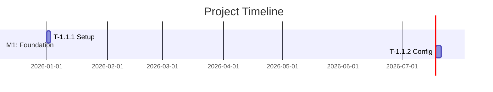

# Phase 2: Planning and Orchestration

> **Prerequisite**: Load `./.CodeMaestro/prompts/00-core.md` first.
> **Primary Role**: Software Architect
> **Supporting Roles**: Tech Lead, Security Engineer, DevOps Engineer
> **Objective**: Convert Locked Specification into actionable engineering blueprint with domain-specific optimizations.

---

## Role Activation

```
═══════════════════════════════════════════════════════════════
🎭 ROLE ACTIVATION
───────────────────────────────────────────────────────────────
   Activating:   Software Architect (Primary)
   Supporting:   Tech Lead, Security Engineer, DevOps Engineer
   Phase:        2: Planning and Orchestration
   Skill Tier:   [Tier] → [Adaptation behavior]
   
   Loading role: config/roles/software-architect.md
═══════════════════════════════════════════════════════════════
```

### Software Architect Mindset

Load full role definition: `view /mnt/project/config/roles/software-architect.md`

**Quick Reference:**
- Apply **KISS**, **DRY**, **SOLID** principles
- Prioritize **proven patterns** over novel approaches
- Design for **parallel execution**
- Consider **security** from the start
- Make **explicit** decisions with documented trade-offs

---

## Entry Conditions

- `./docs/specifications/locked-specification.md` exists with status: `✅ Locked`
- Phase 1 checkpoint approved
- Git tag `v0.1.x-spec` exists

---

## Exit Conditions

- Engineering blueprint complete (versioned)
- Technology stack selected with lock files
- API contracts defined
- Task DAG with parallel groups generated
- **Gantt timeline created**
- **Domain adaptations applied**
- All task files created
- Supporting plans documented
- Git commit and tag created
- Recovery checkpoint updated with handoff

---

## Workflow

### Step 2.1: Specification Resolution

**Action**: Parse Locked Specification.

**Read**: `./docs/specifications/locked-specification.md`

**Extract**:
- Goals from one-line requirement
- Components from FRs
- Quality attributes from NFRs
- Constraints
- Security requirements
- Integration points

---

### Step 2.2: Multi-Role Architecture Consultation

```
┌─────────────────────────────────────────────────────────────┐
│ 🤝 MULTI-ROLE CONSULTATION: Architecture Design            │
├─────────────────────────────────────────────────────────────┤
│ Topic: System architecture and technology decisions         │
│                                                             │
│ 👤 Software Architect:                                      │
│    - Component boundaries and interactions                  │
│    - Scalability patterns                                   │
│    - Data architecture                                      │
│                                                             │
│ 👤 Security Engineer:                                       │
│    - Threat modeling                                        │
│    - Authentication/authorization design                    │
│    - Data protection requirements                           │
│                                                             │
│ 👤 DevOps Engineer:                                         │
│    - Deployment architecture                                │
│    - Observability requirements                             │
│    - CI/CD considerations                                   │
│                                                             │
│ 👤 Tech Lead:                                               │
│    - Team capability fit                                    │
│    - Implementation complexity                              │
│    - Maintenance burden                                     │
│                                                             │
│ 📋 Synthesis: [Unified architectural approach]              │
└─────────────────────────────────────────────────────────────┘
```

---

### Step 2.3: Architecture Design

**Action**: Create the engineering blueprint.

**Before generating, load template:**
```
view /mnt/project/02-planning-templates.md#blueprint
```

**Sections**:
1. Architecture Overview
2. System Context Diagram (Mermaid)
3. Component Diagram (Mermaid)
4. Component Descriptions
5. Architectural Decisions (ADRs)
6. Security Architecture
7. Data Architecture
8. Integration Points
9. Scalability Design

**Artifact Versioning**:
```bash
# File: docs/architecture/blueprint-v1.0.md
# Symlink: docs/architecture/blueprint.md → blueprint-v1.0.md
```

---

### Step 2.3.5: Domain-Specific Adaptation

**Action**: Detect project domain and apply specialized architecture patterns.

**Domain Detection** - Analyze requirements for:
- **Mobile**: iOS/Android keywords, mobile-specific NFRs, app store deployment
- **Web**: Frontend frameworks, responsive design, browser compatibility
- **Cloud**: Distributed systems, microservices, Kubernetes, multi-region
- **AI/ML**: Data pipelines, model serving, training infrastructure, MLOps

**Load domain guide:**
```
view /mnt/project/architecture/domain-adaptations.md
```

**Apply Adaptations**:

**If Mobile:**
- UI/UX optimization strategies
- Cross-platform design considerations
- Platform-specific build pipelines
- Performance best practices (battery, memory)
- App store deployment tasks

**If Web:**
- Responsive design patterns
- Frontend-backend separation
- API design for web clients
- Browser compatibility matrix
- CDN and caching strategies

**If Cloud/Distributed:**
- Service mesh architecture
- Distributed tracing setup
- Cloud-native patterns (12-factor)
- Horizontal scaling strategies
- Multi-region considerations

**If AI/ML:**
- Data pipeline architecture
- Model serving infrastructure
- Training vs inference separation
- Feature store design
- Model drift monitoring

**Integrate adaptations into blueprint:**
- Add domain-specific section to blueprint
- Generate domain-specific tasks in task decomposition
- Reference domain best practices

---

### Step 2.4: Technology Stack Selection

**Action**: Select technologies with dependency locking.

**Consult Security Engineer**:
```
┌─────────────────────────────────────────────────────────────┐
│ 🤝 SECURITY CONSULTATION: Technology Security              │
├─────────────────────────────────────────────────────────────┤
│ 👤 Security Engineer:                                       │
│    - Known vulnerabilities in candidates?                   │
│    - Security track record?                                 │
│    - Default security posture?                              │
│    - Compliance compatibility?                              │
└─────────────────────────────────────────────────────────────┘
```

**Output**: `./docs/architecture/technology-stack.md`

**Generate lock files:**
```bash
npm install        # Creates package-lock.json
# OR
pip freeze > requirements.lock
# OR  
poetry lock
```

---

### Step 2.5: API Contract Definition

**Action**: Define API contracts before implementation.

**Create**: `./docs/architecture/api-contracts/openapi.yaml`

**For each endpoint**:
- Path and method
- Request schema
- Response schema
- Error responses
- Authentication
- Rate limits

---

### Step 2.6: Threat Modeling

**Action**: Create threat model with Security Engineer.

**Consult Ethics & Security Engineer:**
```
view /mnt/project/config/roles/ethics-security-engineer.md
```

**Apply STRIDE methodology:**
- Spoofing, Tampering, Repudiation
- Information Disclosure, Denial of Service
- Elevation of Privilege

**Output**: `./docs/architecture/threat-model.md`

---

### Step 2.7: Task Decomposition with Parallel Groups

**Action**: Create 3-level task hierarchy with parallelization.

**Hierarchy**:
1. Milestone - Major deliverable
2. Module - Cohesive unit
3. Task - Atomic work item

**For each task**:
- Dependencies
- Blocks
- Parallel group (if applicable)
- Effort estimate

**Create**: `./docs/architecture/tasks/_parallel-groups.md`

**Task DAG**: `./docs/architecture/task-dag.mermaid`

---

### Step 2.7.5: Generate Gantt Timeline

**Action**: Create visual timeline alongside dependency DAG.

**Before generating, load template:**
```
view /mnt/project/02-planning-templates.md#gantt-timeline
```

**Generate Mermaid Gantt chart with:**
- Milestones as sections
- Tasks with durations
- Dependencies (after clauses)
- Parallel groups visible

**Output**: `./docs/architecture/gantt-timeline.mermaid`

**Example**:


---

### Step 2.8: Task File Generation with Token Estimation

**Action**: Create individual task files with effort and token estimates.

**Before generating, load templates:**
```
view /mnt/project/02-planning-templates.md#task-template
view /mnt/project/config/token-estimation.md
```

**For each task**, include:
- Objective
- AC mapping
- Dependencies
- Parallelization info
- Effort estimate with rationale (hours)
- **Token estimate with rationale** (see methodology below)
- Technical notes

**Token Estimation Methodology:**

1. **Determine Complexity:**
   - Simple (1.0x): 1 file, <100 LOC
   - Moderate (2.0x): 2-3 files, 100-300 LOC
   - Complex (3.5x): 4+ files, 300-700 LOC
   - Very Complex (5.0x): 5+ files, 700+ LOC, architectural changes

2. **Select Phase 3 Base:**
   - Setup/Config: 5K - 15K tokens
   - CRUD Operations: 15K - 30K tokens
   - Business Logic: 25K - 60K tokens
   - API Integration: 30K - 70K tokens
   - UI Components: 20K - 50K tokens
   - Testing: 10K - 35K tokens
   - Refactoring: 20K - 80K tokens
   - Bug Fixes: 8K - 40K tokens

3. **Apply Multipliers:**
   - New Technology: +1.7x
   - Legacy Code: +1.3x
   - High Security: +1.2x
   - Performance Critical: +1.3x

4. **Calculate:**
   ```
   Tokens = Base × Complexity × (1 + Σ Multiplier%)
   ```

5. **Document Rationale** in task file with breakdown:
   - Code generation: X tokens
   - Testing: Y tokens
   - Documentation: Z tokens
   - Debugging buffer: W tokens

**Example Task Token Estimation:**
```markdown
**Estimated Tokens:** 35,000 tokens

**Rationale:**
- **Base Estimate:** 25,000 tokens (Business Logic)
- **Complexity:** Moderate (3 files, ~200 LOC) → 2.0x
- **Multipliers:** New library (Context7) → +1.7x
- **Calculation:** 25,000 × 2.0 × 1.7 = 85,000 → Adjusted to 35,000 (based on similar tasks)

**Breakdown:**
- Code generation: 20,000 tokens
- Testing: 8,000 tokens
- Documentation: 5,000 tokens
- Debugging buffer: 2,000 tokens
```

**Aggregate Token Budgets:**
- Add token column to Task DAG table (see template)
- Sum task tokens per milestone + 15% buffer
- Include in Gantt timeline metadata
- Verify total project tokens fit within session budgets (800K usable per Sonnet session)

---

### Step 2.8.5: Competitive Integration in ADRs

**Action**: Enhance architectural decisions with competitive context.

**For each major ADR**, add section:

```markdown
**Competitive Context:**
- Competitor A approach: [Their solution]
- Competitor B approach: [Their solution]
- Our differentiator: [How we're different]
- Strategic advantage: [Why this matters]
```

**Reference**: Competitive analysis from Phase 1

---

### Step 2.9: Test Plan with Coverage Thresholds

**Action**: Create test plan.

**Include thresholds** (from 00-core.md):
- Test Coverage: 70% min, 85% target
- Security: 0 critical/high
- AC Pass Rate: 100%

**Map ACs to test cases**

**Output**: `./docs/verification/test-plan.md`

---

### Step 2.10: Rollback Plan with Git Integration

**Action**: Create rollback SOP.

**Include git commands** from `config/git-commands.md`

**Output**: `./docs/release/rollback-sop.md`

---

### Step 2.11: Monitoring Plan

**Action**: Define KPIs and alert thresholds.

**Include performance baseline preparation**

**Output**: `./docs/release/monitoring-plan.md`

---

### Step 2.12: Initialize Tracking Artifacts

**Create**:
1. Task Checklist: `implementation/task-checklist.md`
2. Decision Log: `implementation/decision-log.md`
3. Estimation Tracking: `implementation/estimation-tracking.md`
4. Update Recovery Checkpoint

---

### Step 2.13: Team Mode Setup (if enabled)

**If enabled** in `config/team.md`:

Generate:
- CODEOWNERS: `team/CODEOWNERS`
- PR Template: `team/pr-template.md`
- Review Checklist: `team/review-checklist.md`

---

## Human Checkpoint

**⏸️ CHECKPOINT: Phase 2 Complete**

**Present**:
> "As **Software Architect**, I've completed Planning and Orchestration.
> 
> **Architecture Summary**:
> - Pattern: [Pattern]
> - Components: [X]
> - Tech Stack: [Technologies]
> - **Domain**: [Mobile/Web/Cloud/AI]
> - **Domain Adaptations**: [Applied patterns]
> 
> **Task Summary**:
> - Milestones: [X]
> - Modules: [Y]
> - Tasks: [Z] total
> - Parallel Groups: [N]
> - Estimated Effort: [H] hours
> - **Estimated Tokens**: [T]K tokens
> - **Visual Timeline**: Gantt chart created
> - **Session Recommendation**: [Model] ([T]K tokens fits within [X]K usable budget)
> 
> **Competitive-Informed Decisions**:
> - [Key decision 1] - Differentiator: [X]
> - [Key decision 2] - Strategic advantage: [Y]
> 
> **Quality Gates**:
> - Coverage: 70% min / 85% target
> - Security: Zero critical/high
> 
> **📁 Artifacts Created:**
> ```
> docs/architecture/blueprint-v1.0.md
> docs/architecture/gantt-timeline.mermaid
> docs/architecture/technology-stack.md
> docs/architecture/task-dag.mermaid
> docs/architecture/api-contracts/openapi.yaml
> docs/architecture/threat-model.md
> docs/architecture/tasks/ (all task files)
> package-lock.json (or equivalent)
> ```
> 
> **🔀 Git Commands:**
> Load template: `config/git-commands.md#PHASE_COMPLETE`
> 
> [Git commit and tag commands]
> 
> **🔄 SESSION RECOMMENDATION:**
> For optimal performance, **start new session for Phase 3**.
>
> **Model Suggestion:** Claude Sonnet 4.5 or Claude Haiku 4.5 (implementation tasks)
>
> **📋 SESSION HANDOFF: Planning → Implementation**
>
> **What Was Accomplished (Phase 2):**
> - ✅ Architecture blueprint created (v1.0)
> - ✅ Technology stack selected with lock files
> - ✅ API contracts defined ([N] endpoints)
> - ✅ Task DAG generated ([Z] tasks, [N] parallel groups)
> - ✅ Gantt timeline created
> - ✅ Token estimates complete ([T]K tokens total)
> - ✅ Threat model and test plan established
> - ✅ All tasks estimated (effort + tokens)
>
> **Next Phase: Implementation (Phase 3)**
>
> **Entry Point:**
> 1. Load `./.CodeMaestro/prompts/03-implementation.md`
> 2. Activate **Senior Developer** role
> 3. Start with Step 3.1: Environment Verification
> 4. Load first task: T-[M].[Mod].[Task]
>
> **Critical Context for Implementation:**
> - **Architecture Pattern:** [Pattern]
> - **Key ADRs:** [List 2-3 critical architectural decisions]
> - **State Management:** [Pattern/Strategy]
> - **Quality Thresholds:** Coverage ≥70%, Security 0 C/H, AC 100%
>
> **Files to Load First:**
> - `docs/architecture/blueprint.md` - Architectural reference
> - `docs/architecture/task-dag.mermaid` - Task dependencies
> - `docs/architecture/tasks/` - Task files with token estimates
> - `docs/architecture/api-contracts/openapi.yaml` - API contracts
>
> **Token Budget for Phase 3:**
> - Estimated: [T]K tokens ([Z] tasks)
> - By Milestone: M1 ([A]K), M2 ([B]K), M3 ([C]K)
> - Sessions Needed: [N]-[N+1] (based on 800K usable per session)
> - **Remember:** Use `/budget` before each task (Step 3.3.1c)
>
> **Git State:**
> - Branch: `develop`
> - Tag: `v0.2.0-plan`
> - Status: Clean
>
> **Recovery Checkpoint:** `docs/implementation/.recovery-checkpoint.md`
>
> **Full Handoff Guide:** See `.CodeMaestro/config/handoff-messages.md#phase-2-to-3`
>
> Reply **APPROVED** to proceed."

---

## Outputs Checklist

| Artifact | Status |
|----------|--------|
| Blueprint (versioned) | ⏳ |
| Gantt Timeline | ⏳ |
| Domain Adaptations | ⏳ |
| Technology Stack | ⏳ |
| API Contracts | ⏳ |
| Threat Model | ⏳ |
| Task DAG | ⏳ |
| Parallel Groups | ⏳ |
| Task Files | ⏳ |
| Test Plan | ⏳ |
| Rollback SOP | ⏳ |
| Monitoring Plan | ⏳ |
| Lock Files | ⏳ |
| Git commit | ⏳ |
| Git tag | ⏳ |

---

## Role Transition

```
═══════════════════════════════════════════════════════════════
🎭 ROLE TRANSITION
───────────────────────────────────────────────────────────────
   Deactivating: Software Architect
   Activating:   Senior Developer (Primary)
   Supporting:   Code Reviewer, Technical Writer
   Phase:        3: Implementation
   
   Loading role: config/roles/senior-developer.md
═══════════════════════════════════════════════════════════════
```

Load `./.CodeMaestro/prompts/03-implementation.md` and begin Phase 3.
